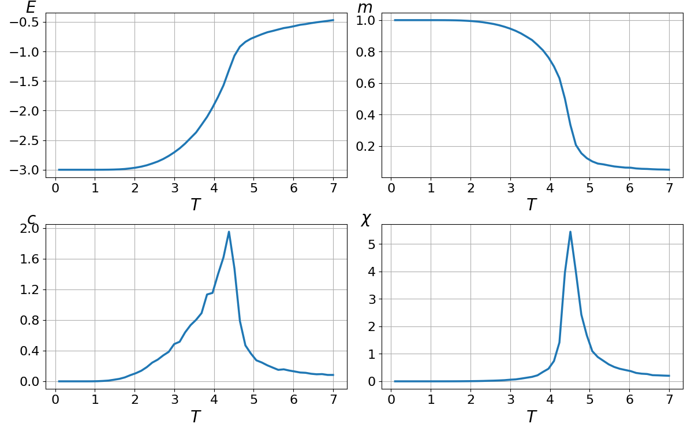

# Моделирование фазовых переходов в ферромагнетиках методом Монте-Карло на основе модели Изинга

Эта программа предназначена для моделирования фазового перехода 
второго рода в ферромагнетиках методом Монте-Карло. Используется 
модель Изинга для кубической решётки.

## Возможности

* Генерация конфигураций кристаллической структуры
* Расчёт термодинамических величин
* Построение графиков зависимостей термодинамических величин от температуры
* Возможность задавать параметры моделирования
* Нахождение критической температуры из графиков

## Пример моделирования

Пример расчёта для решётки $10 \times 10 \times 10$

По пикам теплоёмкости и магнитной восприимчивости можно определить, что 
критическая температура $T_c \approx 4.5$.

## Модель Изинга 

Модель Изинга представляет собой кристаллическую решётку, где в 
каждом узле находится спин, который может быть направлен только 
вверх или вниз, что обозначается как $s = \pm 1$.

Энергия системы описывается гамильтонианом:

$$
\mathcal{H}=-J \sum\limits_{ \langle i, j \rangle}{s_i s_j}- B \sum\limits_i{s_i}
$$

где 

$J$ - константа обменного взаимодействия соседних спинов $i$ и $j$

$B$ - внешнее магнитное поле (в данном моделировании оно принимается 
равным нулю)

В энергии взаимодействия учитывается вклад только ближайших соседних спинов.

При низких температурах система упорядочена: большинство спинов направлены одинаково, возникает 
макроскопическая намагниченность. При высоких температурах тепловое движение разрушает порядок, 
спины направлены хаотично, и намагниченность падает до нуля. Точка, где происходит это резкое изменение, 
называется фазовым переходом.

Удельные теплоёмкость $c$ и магнитная восприимчивость $\chi$ вычисляются через флуктуации полных энергии и 
намагниченности соответственно. В области фазового перехода флуктуации максимальны, $c$ и $\chi$ резко 
возрастают, что позволяет использовать их как индикатор перехода. Данные величины вычисляются по следующим 
формулам:

Удельная энергия:

$$
\langle e \rangle = - \dfrac{J}{N} \sum\limits_{\langle i,~j \rangle}{s_i s_j}
$$

Удельная намагниченность:

$$
\langle m \rangle = \dfrac{1}{N} \sum\limits_i^N{s_i}
$$

Удельная теплоёмкость:

$$
c = \frac{\beta^2}{N} \left( \langle E^2 \rangle - \langle E \rangle^2 \right)
$$

Удельная магнитная восприимчивость:

$$
\chi = \frac{\beta}{N}  \left( \langle M^2 \rangle - \langle M \rangle^2 \right)
$$

где 

$N$ - количество спинов

$\beta = \dfrac{1}{T k_B}$ - обратная температура

постоянная Больцмана $k_B = 1$

$T = \dfrac{k_B T'}{J}$,
($T'$ - абсолютная температура)

## Реализация

Метод Монте-Карло позволяет генерировать последовательность спиновых конфигураций, 
которая соответствует тепловому равновесию при заданной температуре. Конкретный способ, 
как предлагаются и принимаются изменения конфигурации, задаётся алгоритмом Метрополиса.

Необходимо проделать тысячи шагов Монте-Карло (MCS) для "термализации" — чтобы система "забыла" 
начальное состояние и пришла к тепловому равновесию. Затем выполняем ещё тысячи шагов, во 
время которых измеряем нужные физические величины.

### Стек:

NumPy, Matplotlib

## Планируемые модернизации

*   Добавление модели Гейзенберга
*   Расчёт времени корреляции